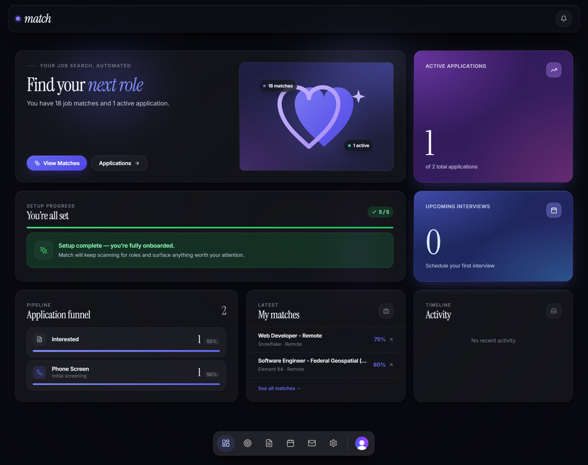

<div align="center">

# Match

**An AI-powered career management dashboard.**
Find matching roles, tailor your resume to each one, research the company, prep for the interview, and track every application — all in one place.

**[Live demo →](https://match-nu-gold.vercel.app)**

[](https://match-nu-gold.vercel.app)
[](https://nextjs.org)
[](https://react.dev)
[](https://www.typescriptlang.org)
[](https://www.prisma.io)
[](https://www.postgresql.org)
[](https://clerk.com)
[](https://n8n.io)
[](https://vercel.com)

<br />

[](https://match-nu-gold.vercel.app)

</div>

---

## Why this exists

Job hunting is a manual, repetitive workflow: scrape boards, score fit, rewrite the resume to match each posting, research the company, prep for interviews, track every reply. Match automates the parts a computer should do and surfaces the parts you need to see.

The interesting engineering problem isn't the dashboard — it's the **orchestration**: long-running AI tasks (resume tailoring, company research, interview prep) shouldn't block the UI, shouldn't lose state on a page refresh, and shouldn't silently fail when the LLM returns malformed JSON or a third-party API rate-limits you.

The solution is a thin Next.js app talking to an n8n workflow backend over signed webhooks, with the heavy lifting (scraping, AI calls, PDF rendering, email) running asynchronously in n8n. The app polls Postgres for completion and renders results when they land.

---

## Architecture

```
                ┌─────────────────────────────────────────────┐
                │                  Browser                    │
                │  Next.js 16 (App Router) · React 19 · Clerk │
                └──────────────┬───────────────────────┬──────┘
                               │                       │
                  Authenticated│API calls    Polls for │
                  (Clerk JWT)  │             updates   │
                               ▼                       │
                ┌─────────────────────────────────────────────┐
                │           Next.js API Routes                │
                │   /api/match/jobs · /api/tailor/resume      │
                │   /api/research/company · /api/resume/*     │
                │   /api/internal/resume/[userId]  ──┐        │
                └──────────────┬───────────────┬─────┘        │
                               │               │              │
                Signed webhooks│        Direct │ DB reads     │
              (x-webhook-secret│       (Prisma)│              │
                               ▼               ▼              │
                ┌─────────────────────────┐   ┌───────────────┴──┐
                │   n8n workflow engine   │   │   PostgreSQL     │
                │   tailor-resume         │◄──┤    (Neon)        │
                │   company-research      │   │                  │
                │   match-job             │──►│   user_profiles  │
                │   interview-prep        │   │   jobs, matches  │
                │   application-tracker   │   │   tailored_*     │
                │   followup-response     │   │   research, prep │
                └──────┬───────┬──────────┘   └──────────────────┘
                       │       │
                  Groq │       │ JSearch · NewsData.io · PDFShift
                  (LLM)│       │ RSS feeds · LinkedIn scrape
                       ▼       ▼
                  ┌────────────────────┐
                  │   External APIs    │
                  └────────────────────┘
```

**Request lifecycle for the AI features:**

1. User clicks "Tailor Resume" → `POST /api/tailor/resume` signs the payload with `N8N_WEBHOOK_SECRET` and POSTs to the n8n webhook.
2. n8n calls back into `/api/internal/resume/[userId]` (same shared secret) to fetch the user's original resume bytes from Postgres.
3. n8n parses the PDF, feeds it to Groq with a "preserve original layout, rewrite content" prompt, and writes the HTML into `tailored_resumes`.
4. The frontend polls `/api/tailor/resume/[jobId]/status` every 3 s for up to 5 min. When the row appears, it enables the "Download Resume" button.
5. Download → PDFShift renders the stored HTML to PDF on demand.

---

## Features

| Area | Highlights |
|---|---|
| **Dashboard** | Open applications, upcoming interviews, conversion funnel (Applied → Screened → Interview → Offer), onboarding checklist, activity feed. |
| **Job matches** | AI-scored against the user's profile (Groq), skill chips, URL-state search + filter pills, paged carousel UI. |
| **Resume tailoring** | LLM rewrites content while preserving the original layout. Original PDF stored as BYTEA; tailored copy stored as HTML and rendered to PDF on download. |
| **Company research** | Scrapes company site + recent news (NewsData.io), produces a brief: overview, mission, why-hiring, talking points, smart questions, red flags. |
| **Interview prep** | Per-application brief: role analysis, behavioural + technical questions, STAR answer scaffolds, salary guidance. Optional LinkedIn scrape of the interviewer. HTML rendered in a `sandbox=""` iframe for safety. |
| **Application tracking** | Status pipeline with per-stage conversion rates, segmented status tabs, scheduled-interview modal, follow-up logging with server-side response-rate recompute. |
| **Notifications** | Real signals only: interviews within 7 days, follow-ups awaiting reply, fresh matches. |
| **Settings** | Drag-and-drop resume upload (PDF/DOC/DOCX, 5 MB cap), skills/titles/industries as comma-list chips, salary + work-type preferences. |

---

## Engineering highlights

Things I'd point a reviewer to:

- **Pre-flight diagnostics, not stuck spinners.** `POST /api/match/jobs` runs an eligibility query before triggering n8n. When the daily scrape has produced zero new jobs, the user sees *"You're caught up — every job in the last 7 days has been scored"* instead of staring at a spinner for 2 minutes. The button now distinguishes four failure modes: `no_jobs_in_db`, `no_recent_scrape`, `all_jobs_already_matched`, `n8n_unreachable`. See [app/api/match/jobs/route.ts](app/api/match/jobs/route.ts).
- **Polling that tracks the *right* signal.** The "Find New Matches" client originally watched only `count` of pending matches. If the AI rejected every candidate as `<70`, the count never moved and the user thought it was stuck. The current poller also watches `total` and `lastMatchAt`, so it correctly reports *"Scoring finished — no strong matches"*. See [components/find-matches-button.tsx](components/find-matches-button.tsx).
- **Signed server-to-server callback.** n8n needs the user's original resume to preserve formatting during tailoring. Resume bytes live in Postgres BYTEA (not a public bucket), and n8n reads them via `GET /api/internal/resume/[userId]` authenticated by a shared `x-webhook-secret` header — same secret used to sign outbound webhook calls. See [app/api/internal/resume/[userId]/route.ts](app/api/internal/resume/[userId]/route.ts) and [lib/n8n-client.ts](lib/n8n-client.ts).
- **Resume storage in Postgres, not S3.** Files cap at 5 MB and live on the same row as the rest of the user profile. No public URL, no signed-URL plumbing, no extra dependency, and Vercel's read-only `/var/task/public` filesystem doesn't matter. See [prisma/migrations/resume_blob_columns.sql](prisma/migrations/resume_blob_columns.sql).
- **Stacking-context-aware loaders.** The fullscreen loader uses `position: fixed`, but a `transform`ed ancestor in the paginated job-cards container created a new containing block and the loader was rendering inside the page slide. Fixed by rendering through `React.createPortal(content, document.body)`. See [components/ui/brand-loader.tsx](components/ui/brand-loader.tsx).
- **Sandboxed third-party HTML.** n8n workflows emit interview-prep / research HTML that's user-influenced. It's rendered inside `<iframe sandbox="">` with a fresh document, so any reflected injection can't reach the parent DOM. See [components/prep-html-viewer.tsx](components/prep-html-viewer.tsx).
- **Server-derived `user_id` everywhere.** Every API route derives `userId` from the Clerk session — the client never sends it, even when it's in the form body. Resource-bound routes (`/api/track/application`, etc.) additionally call `verifyOwnership()` before mutating. See [lib/auth.ts](lib/auth.ts) and [lib/validation.ts](lib/validation.ts).
- **Defensive AI response handling.** LLM JSON parsing accepts both OpenAI-shape (`choices[0].message.content`) and Gemini-shape (`candidates[0].content.parts[0].text`), strips markdown fences, and on failure writes a placeholder row with `confidence_score = 10` + the raw response — so the UI degrades visibly instead of breaking. See the company-research and tailor-resume flows in [Match.json](Match.json).
- **Dev vs prod webhook routing.** `lib/n8n-client.ts` automatically targets `/webhook-test/...` in development (lets you click "Listen for test event" in the n8n editor) and `/webhook/...` in production. Overridable via `N8N_FORCE_TEST_WEBHOOKS` for the edge cases.

---

## Tech stack

| Layer        | Choice                                                        |
| ------------ | ------------------------------------------------------------- |
| Framework    | **Next.js 16** (App Router, RSC + server actions)             |
| UI           | **React 19**, Tailwind CSS, Radix primitives, lucide icons    |
| State        | Zustand (toast store), React `useState` everywhere else       |
| Database     | **PostgreSQL 16** via **Prisma 7** (hosted on Neon)           |
| Auth         | **Clerk** (session cookies, middleware-protected routes)      |
| Workflows    | **n8n** — 6 webhooks orchestrating scraping, LLM calls, email |
| LLM          | **Groq** (Llama 3.1 8B for scoring + tailoring + research)    |
| Job sources  | RapidAPI JSearch, Remotive RSS, We Work Remotely RSS          |
| News         | NewsData.io                                                   |
| PDFs         | PDFShift (server-side HTML → PDF)                             |
| Email        | Gmail (via n8n's built-in Gmail node)                         |
| Charts       | Recharts                                                      |
| Hosting      | **Vercel** (app), **Neon** (Postgres)                         |

---

## Local setup

```bash
git clone https://github.com/<you>/match.git
cd match
npm install
cp .env.example .env       # fill in the values (see Environment variables)
npm run db:push            # creates tables from prisma/schema.prisma
npm run dev                # http://localhost:3000
```

Then in n8n: **Workflows → Import from File** → pick `Match.json` from the repo root. Activate the workflow.

Sign in with Clerk, drop a PDF resume in **Settings**, then click **Find New Matches** on the Jobs page.

### Prerequisites

- Node.js **18+**
- A PostgreSQL database (Neon recommended)
- A [Clerk](https://dashboard.clerk.com) application
- An n8n instance — self-hosted or n8n Cloud free tier is enough
- *Optional:* a [PDFShift](https://pdfshift.io) API key (only needed for tailored-resume PDF downloads)

---

## Environment variables

| Variable | Required | Description |
|---|---|---|
| `DATABASE_URL` | ✅ | PostgreSQL connection string. **Use the pooled URL on Vercel** (Neon: hostname ends with `-pooler`). |
| `NEXT_PUBLIC_CLERK_PUBLISHABLE_KEY` | ✅ | Clerk publishable key. |
| `CLERK_SECRET_KEY` | ✅ | Clerk secret key. |
| `N8N_BASE_URL` | ✅ | Root URL of the n8n instance, no trailing slash. |
| `N8N_WEBHOOK_SECRET` | ✅ in prod | Shared secret sent as `x-webhook-secret` on every outbound n8n call and required on the `/api/internal/*` callbacks. Configure the same value on each n8n Webhook node (Authentication: Header Auth). |
| `NEXT_PUBLIC_APP_URL` | ✅ in prod | Public origin of this app — used to build the callback URL n8n hits to fetch original-resume bytes. e.g. `https://match.example.com`. |
| `PDFSHIFT_API_KEY` | ⚪ | Needed for `/api/tailor/resume/[jobId]/download` to render tailored resumes to PDF. |
| `N8N_API_KEY` | ⚪ | Only required for n8n execution-status polling. |
| `N8N_FORCE_TEST_WEBHOOKS` | ⚪ | `true` to force `/webhook-test/` URLs in prod; `false` to force `/webhook/` in dev. Default is automatic (`NODE_ENV`-based). |

Clerk middleware ([middleware.ts](middleware.ts)) protects every route except `/sign-in`, `/sign-up`, `/api/webhooks/*`, and `/api/internal/*` (the last is authed via `N8N_WEBHOOK_SECRET`). Unauthenticated requests to anything else get a `401`.

### Resume storage migration

Base resumes are stored as BYTEA on `user_profiles` (`base_resume_data` + metadata columns). Before deploying, run [prisma/migrations/resume_blob_columns.sql](prisma/migrations/resume_blob_columns.sql) once against your Postgres — the migration is idempotent.

---

## Project layout

```
app/
├── api/                       # all routes auth'd via Clerk except /api/internal/*
│   ├── followup/response/     # log replies, recompute response rate
│   ├── interview-prep/        # trigger n8n, serve generated PDFs
│   ├── internal/resume/[id]/  # server-to-server: n8n fetches user resume bytes
│   ├── interviews/            # list interviews for the user
│   ├── match/jobs/            # trigger matching, count + diagnostics for the button
│   ├── profile/update/        # save profile (zod-validated)
│   ├── research/company/      # trigger + read company research
│   ├── resume/                # upload / delete / serve inline
│   ├── tailor/resume/         # trigger tailoring, poll status, PDF download
│   └── track/application/     # create / update_status / schedule_interview
├── applications/              # pipeline + status filter + search
├── followups/                 # follow-up list with response tracking
├── interview-prep/[id]/       # sandboxed iframe viewer
├── interviews/                # upcoming + past, schedule modal
├── jobs/                      # match cards, search, filters
├── research/[jobId]/          # company research report viewer
├── settings/                  # profile, resume upload, preferences
├── layout.tsx                 # Header + Toaster + NavDock
├── loading.tsx                # brand "Match…" route loader
└── page.tsx                   # dashboard

components/                    # client components
├── ui/                        # toast, dock, brand-loader (shared primitives)
├── job-match-card.tsx         # one match card — tailor / research / apply
├── job-matches-paged.tsx      # paged carousel
├── find-matches-button.tsx    # "Find New Matches" trigger + diagnostic toasts
├── workflow-loader.tsx        # fullscreen overlay during n8n calls (portal'd)
├── interview-prep-button.tsx
├── settings-form.tsx
└── …

lib/
├── auth.ts                    # requireAuth / requireUserWithSync / verifyOwnership
├── n8n-client.ts              # typed webhook wrapper with timeouts + signing
├── notifications.ts           # server fn for the notifications popover
├── prisma.ts                  # Prisma client singleton
├── utils.ts
└── validation.ts              # zod schemas + sanitizeString

prisma/
├── schema.prisma              # 14 models
└── migrations/
    ├── clerk_auth_migration.sql
    └── resume_blob_columns.sql

Match.json                     # exportable n8n workflow (6 webhooks + scrape cron)
```

---

## Deployment (Vercel)

1. Push to GitHub.
2. **New Project** on Vercel → import the repo. Auto-detects Next.js.
3. Add the env vars above. `DATABASE_URL` = Neon **pooled** connection string.
4. Click Deploy. Build runs `prisma generate && next build` (configured in `vercel.json`).
5. In Neon's SQL editor, run [prisma/migrations/resume_blob_columns.sql](prisma/migrations/resume_blob_columns.sql) once.
6. Configure Clerk's allowed origins to include your Vercel domain.
7. Import [Match.json](Match.json) into n8n, set the `Match Webhook Secret` Header Auth credential to your `N8N_WEBHOOK_SECRET`, attach it to every Webhook Trigger node, and activate the workflow.

The app is a plain Node + Postgres app, so it'll also run on Railway, Render, Fly.io, or a regular server. Just match the env vars.

---

## Security

- **Auth everywhere.** Every API route calls `requireAuth()` from [lib/auth.ts](lib/auth.ts). Resource-bound routes additionally call `verifyOwnership()` against the row's `user_id` before mutating. The client never sends `user_id`.
- **Zod-validated bodies.** Every POST body is parsed through a schema in [lib/validation.ts](lib/validation.ts). String fields are HTML-escaped before reaching Prisma to neutralise reflected XSS via downstream LLM output.
- **Signed n8n traffic.** Every outbound webhook call carries `x-webhook-secret`. The n8n side enforces this via a Header Auth credential on each Webhook Trigger. The reverse `/api/internal/*` callback validates the same secret.
- **Sandboxed third-party HTML.** Interview-prep and research HTML come from n8n + an LLM and are rendered inside `<iframe sandbox="">` with a fresh document.
- **Security headers** set globally in [next.config.mjs](next.config.mjs): `X-Content-Type-Options: nosniff`, `X-Frame-Options: DENY`, `Referrer-Policy: strict-origin-when-cross-origin`, `Permissions-Policy: camera=(), microphone=(), geolocation=()`.
- **File uploads** are Clerk-authed, MIME-whitelisted (PDF / DOC / DOCX), 5 MB capped, with the storage filename derived from the authenticated `userId` — never the client-supplied filename.

**Known gaps (not yet shipped):** rate limiting, CSRF tokens on top of Clerk's `SameSite=Lax`, full Content-Security-Policy, Postgres row-level security (the policies are drafted in `prisma/rls-policies.sql` but not enabled).

---

## Development

```bash
npm run dev            # dev server on :3000
npm run build          # prisma generate + next build
npm run start          # serve the production build locally
npm run lint           # next lint
npm run db:generate    # regenerate the Prisma client
npm run db:push        # push schema changes to the DB without migrations
npm run db:studio      # Prisma Studio (DB inspector)
```

---

## Troubleshooting

| Symptom | Likely cause |
|---|---|
| `Unauthorized` on every API call | Clerk env vars missing, or the Clerk dashboard's allowed origins don't include your dev/prod URL. |
| Resume upload errors with `ENOENT '/var/task/public'` | The BYTEA migration hasn't been run on prod yet. Apply [prisma/migrations/resume_blob_columns.sql](prisma/migrations/resume_blob_columns.sql) in Neon's SQL editor. |
| "Find New Matches" returns nothing | Either no jobs were scraped today (check `SELECT MAX(scraped_at) FROM jobs`) or every job has already been scored. The button's toast now spells out which case it is. |
| n8n calls 404 in dev | Default is `/webhook-test/...`. Click **"Listen for test event"** on the relevant Webhook node in the n8n editor, or set `N8N_FORCE_TEST_WEBHOOKS=false` to hit production URLs. |
| `Loader2` import errors after switching branches | Turbopack cache wedge. `rm -rf .next` and restart the dev server. |
| Pages feel slow in dev | `npm run dev` is intentionally unoptimised. Try `npm run build && npm start`. Also confirm you're using Neon's **pooled** connection string. |
| Tailored resume looks generic | The n8n workflow falls back to a template when it can't read the original resume. Check `N8N_WEBHOOK_SECRET` is set on both sides and the n8n `Fetch Original Resume` node returns 200. |

---

## License

MIT — see [LICENSE](LICENSE).
